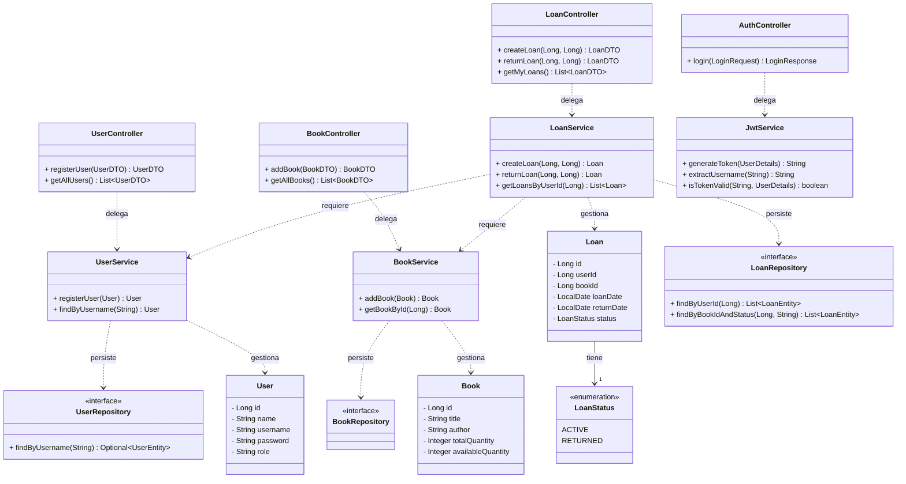

# Diagrama de Clases de la Biblioteca

Este diagrama ilustra las clases principales del sistema separadas convenientemente en Modelos, Controladores (API), Servicios (Lógica) y Repositorios (Persistencia), omitiendo deliberadamente la extensa capa de mapeos (`Mappers`) y excepciones (`Exceptions`) para facilitar su lectura.

