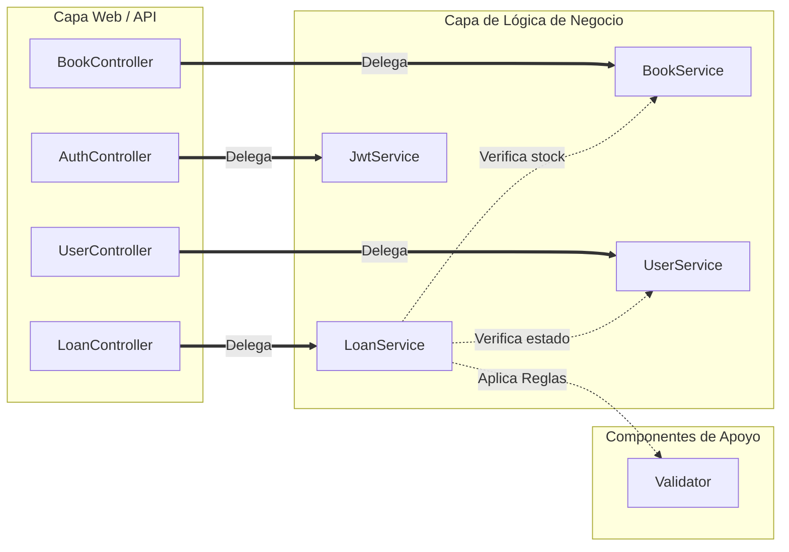

# Diagrama de Componentes de la Biblioteca

Este diagrama ilustra la arquitectura de componentes del sistema, incluyendo los flujos de seguridad y validación.

```mermaid
flowchart LR
    %% Definición de Controladores (API)
    subgraph Web [Capa Web / API]
        direction TB
        BC[BookController]
        UC[UserController]
        LC[LoanController]
        AC[AuthController]
    end

    %% Definición de Servicios (Lógica de Negocio)
    subgraph Core [Capa de Lógica de Negocio]
        direction TB
        BS[BookService]
        US[UserService]
        LS[LoanService]
        JS[JwtService]
    end

    %% Apoyo y Reglas
    subgraph Utils [Componentes de Apoyo]
        V[Validator]
    end

    %% Relaciones Controlador -> Servicio
    BC == Delega ==> BS
    UC == Delega ==> US
    LC == Delega ==> LS
    AC == Delega ==> JS

    %% Relaciones internas entre servicios (El LoanService necesita de los otros dos)
    LS -. "Verifica stock" .-> BS
    LS -. "Verifica estado" .-> US

    %% Dependencia de Validadores
    LS -. "Aplica Reglas" .-> V
```
