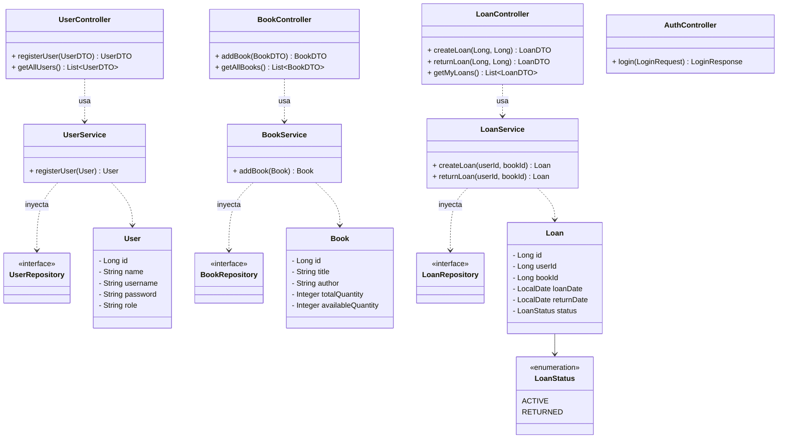
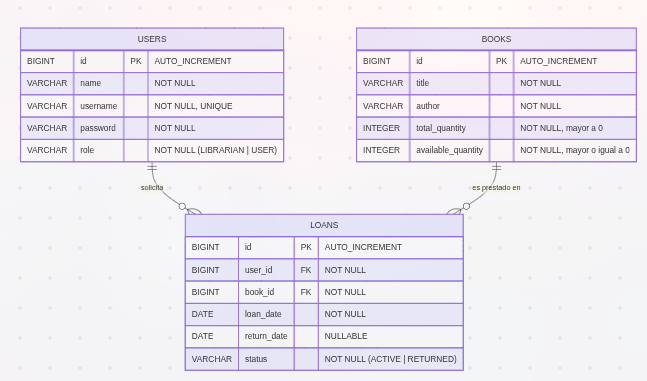

# Arquitectura y Diseño del Sistema 🏛️

Este documento describe la arquitectura y el diseño técnico del sistema de biblioteca, detallando su estructura a través de diversos diagramas.

## 🏗️ Diagramas 

### 1. Diagrama de Componentes de la Biblioteca
> 

- La aplicación de biblioteca sigue una arquitectura en capas donde el 
usuario final interactúa con el sistema a través del Frontend, 
que es la interfaz de usuario. 
- El Frontend consume los servicios expuestos por el Backend 
mediante una API, solicitando información o enviando acciones 
como buscar libros, iniciar sesión o solicitar préstamos. 
- El Backend actúa como la capa de lógica de negocio, 
encargándose de procesar estas solicitudes, aplicar reglas del 
sistema y gestionar las operaciones necesarias. Finalmente, 
el Backend se comunica directamente con la Base de Datos, 
que es la capa de persistencia donde se almacenan y administran 
los datos de libros, usuarios y préstamos, garantizando que el 
Frontend nunca acceda a los datos de forma directa por razones de 
seguridad y 
organización.

---

### 2. Diagrama Específico de Componentes

> 

El sistema backend se organiza en controladores, 
servicios y componentes de apoyo. Los controladores 
actúan como punto de entrada para las peticiones del 
Frontend: BookController gestiona solicitudes relacionadas 
con el catálogo de libros, UserController maneja las operaciones de 
los usuarios y LoanController procesa las solicitudes de préstamos. 
Estos controladores delegan el procesamiento a los servicios, que contienen 
la lógica de negocio del sistema: BookService administra las operaciones sobre 
libros, UserService gestiona la información y estado de los usuarios, y 
LoanService se encarga del proceso de préstamos y devoluciones. 
Para completar procesos más complejos, los servicios colaboran entre sí; por ejemplo, 
LoanService consulta a UserService para verificar al usuario y a BookService para confirmar 
la disponibilidad de un libro. Finalmente, LoanService utiliza un Validator 
para asegurar que todas las reglas del sistema se cumplan antes de registrar un préstamo, 
garantizando la integridad y validez de las operaciones.

---

### 3. Diagrama de Clases
_Estructura detallada de las entidades, servicios, controladores y sus relaciones clave._

--- 

### 4. Módelo entidad - relación 

> 

El diagrama muestra una arquitectura de base de datos clara y 
bien normalizada para gestionar una biblioteca. La relación muchos 
a muchos entre USERS y BOOKS, usando la tabla LOANS, permite registrar 
cada préstamo y mantener la integridad de los datos. 
Además, el control entre total_quantity y available_quantity ayuda a manejar el 
inventario en tiempo real sin inconsistencias. 
En general, es un modelo simple pero sólido para controlar libros y usuarios.