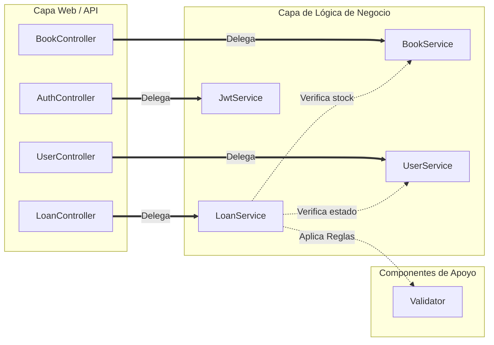
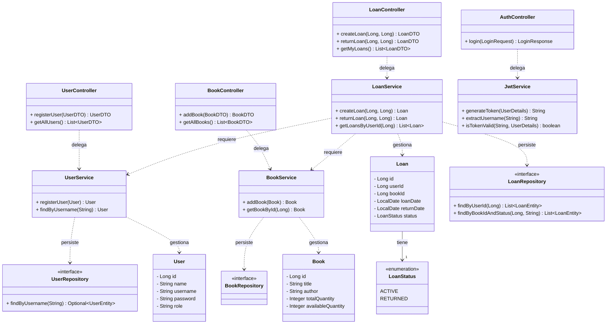
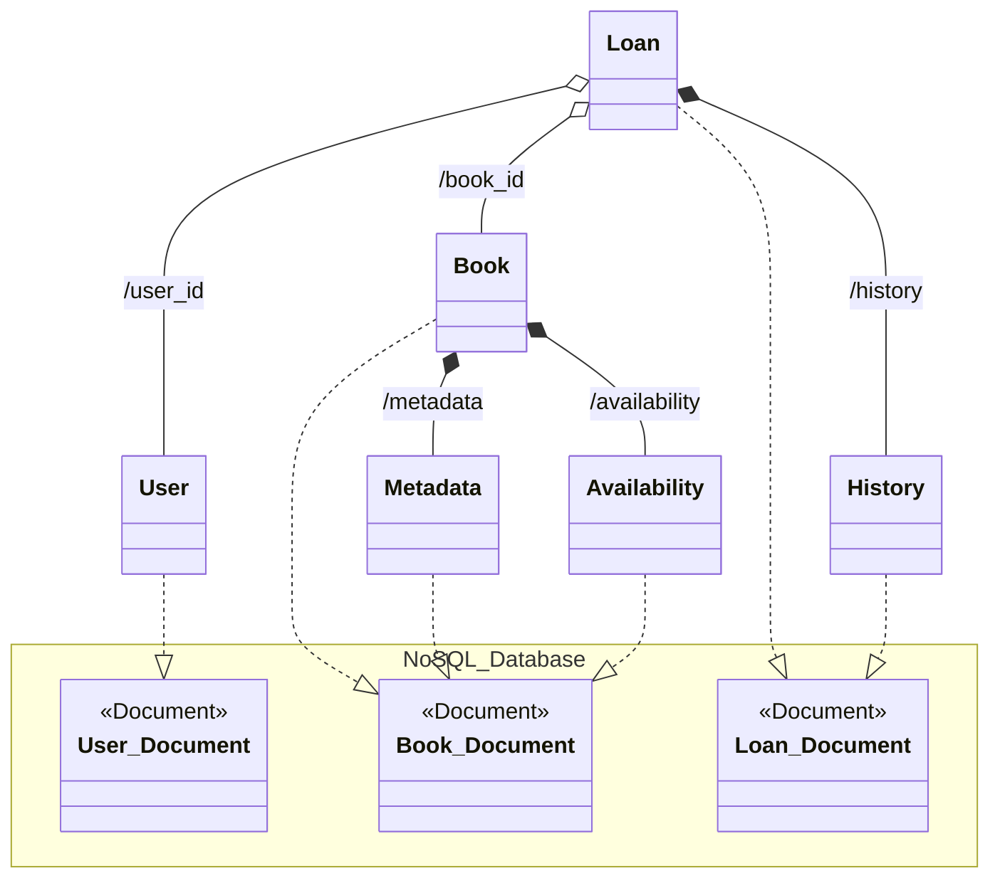

# Arquitectura y Diseño del Sistema 🏛️

Este documento amplía el **diseño de alto nivel** del backend con diagramas UML, Mermaid y modelos de datos. La visión consolidada (contexto, capas, perfiles `mongo`/`relational`, seguridad y despliegue) está en [**docs/high-level-design-backend.md**](../../docs/high-level-design-backend.md) *(Reto #8)*.

A continuación: detalle de la arquitectura del sistema de biblioteca a través de diagramas.

## 🏗️ Diagramas 

### 1. Diagrama de Componentes de la Biblioteca
> 

- La aplicación de biblioteca sigue una arquitectura en capas donde el 
usuario final interactúa con el sistema a través del Frontend, 
que es la interfaz de usuario. 
- El Frontend consume los servicios expuestos por el Backend 
mediante una API, solicitando información o enviando acciones 
como buscar libros, iniciar sesión o solicitar préstamos. 
- El Backend actúa como la capa de lógica de negocio, 
encargándose de procesar estas solicitudes, aplicar reglas del 
sistema y gestionar las operaciones necesarias. Finalmente, 
el Backend se comunica directamente con la Base de Datos, 
que es la capa de persistencia donde se almacenan y administran 
los datos de libros, usuarios y préstamos, garantizando que el 
Frontend nunca acceda a los datos de forma directa por razones de 
seguridad y 
organización.

---

### 2. Diagrama Específico de Componentes

Este diagrama ilustra una arquitectura de software multicapa diseñada bajo
el principio de Separación de Responsabilidades (SoC), donde la Capa Web 
actúa como el punto de entrada mediante controladores que gestionan las 
peticiones externas. Estos controladores se comunican con la Capa de 
Lógica de Negocio a través de interfaces de servicio (representadas 
por los conectores circulares), lo que garantiza un desacoplamiento 
que facilita el mantenimiento y la escalabilidad del sistema.
En el núcleo, los servicios procesan las reglas de negocio,
destacando el componente LoanService como un eje central que 
interactúa con BookService y UserService para verificar la
disponibilidad y el estado de los usuarios antes de ejecutar 
un préstamo. Finalmente, el flujo se apoya en un Validator 
transversal para asegurar que todas las operaciones cumplan 
con las reglas de integridad del sistema antes de ser procesadas.

---

### 3. Diagrama de Clases

Este sistema sigue una arquitectura de tres capas que separa las 
responsabilidades de forma clara: los Controladores gestionan las 
peticiones externas y la seguridad mediante JwtService, los Servicios
ejecutan la lógica de negocio y validaciones entre componentes, y los 
Repositorios se encargan de la persistencia de datos. 
El modelo de dominio, compuesto por User, Book y Loan, 
define las reglas e integridad de la información, 
permitiendo que el LoanService actúe como orquestador 
principal al requerir datos de usuarios y libros para 
procesar préstamos de manera segura y eficiente.

--- 

### 4. Módelo entidad - relación 

> 

El diagrama muestra una arquitectura de base de datos clara y 
bien normalizada para gestionar una biblioteca. La relación muchos 
a muchos entre USERS y BOOKS, usando la tabla LOANS, permite registrar 
cada préstamo y mantener la integridad de los datos. 
Además, el control entre total_quantity y available_quantity ayuda a manejar el 
inventario en tiempo real sin inconsistencias. 
En general, es un modelo simple pero sólido para controlar libros y usuarios.

--- 

### 4. Diagrama Modelo No Relacional 

Este diseño refleja una arquitectura híbrida de persistencia NoSQL muy bien pensada para una base de datos documental como MongoDB. Lo más destacado es cómo aprovechas el patrón de embebido (composición) para agrupar datos que siempre se consultan juntos, como los detalles de Metadata y Availability dentro del documento Book, lo que reduce drásticamente el número de lecturas necesarias en el servidor. Al mismo tiempo, utilizas con acierto el patrón de referencia (agregación) en Loan para vincular usuarios y libros mediante IDs, evitando la duplicación masiva de datos que suelen cambiar con frecuencia. En resumen, el diagrama muestra una transición clara de la lógica de negocio a una estructura física optimizada para minimizar los JOINs en tiempo de ejecución, manteniendo la integridad referencial solo donde es estrictamente necesario.