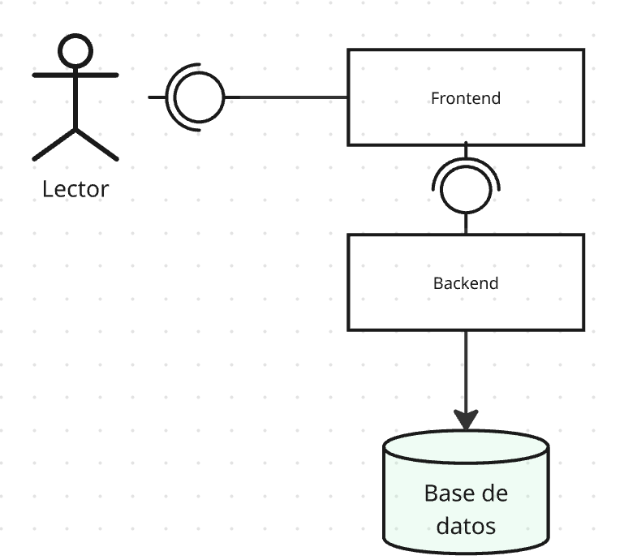
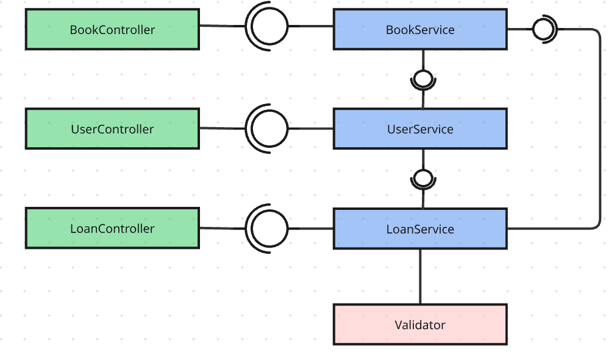
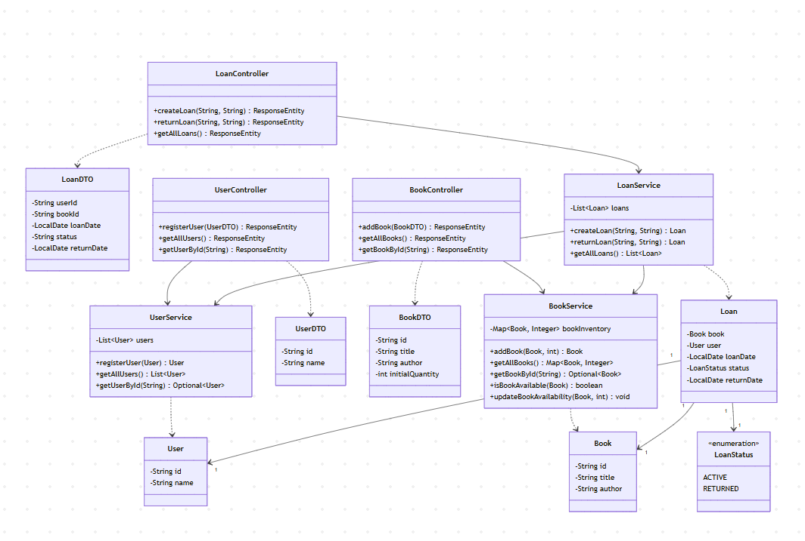

# Arquitectura y Diseño del Sistema 🏛️

Este documento describe la arquitectura y el diseño técnico del sistema de biblioteca, detallando su estructura a través de diversos diagramas.

## 🏗️ Diagramas 

### 1. Diagrama de Componentes de la Biblioteca
_Descripción general de la interacción entre los principales bloques del sistema._

> 

---

### 2. Diagrama Específico de Componentes
_Detalle profundo de los módulos internos, servicios y su comunicación._

> 

---

### 3. Diagrama de Clases
_Estructura detallada de las entidades, servicios, controladores y sus relaciones._

> 