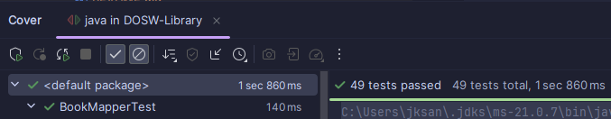
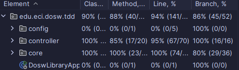
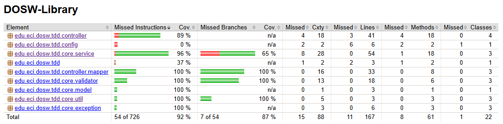
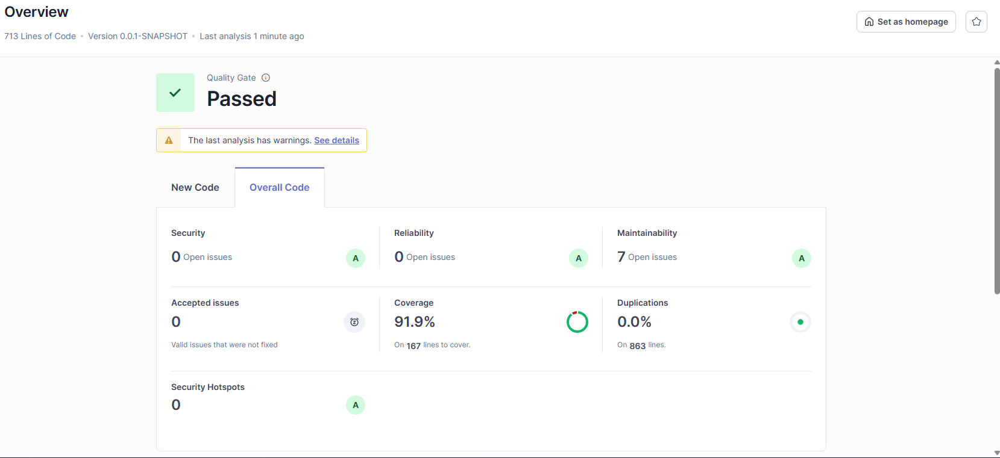
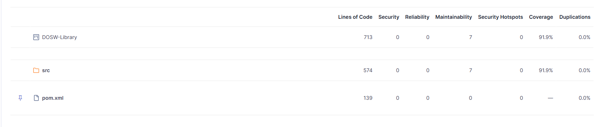
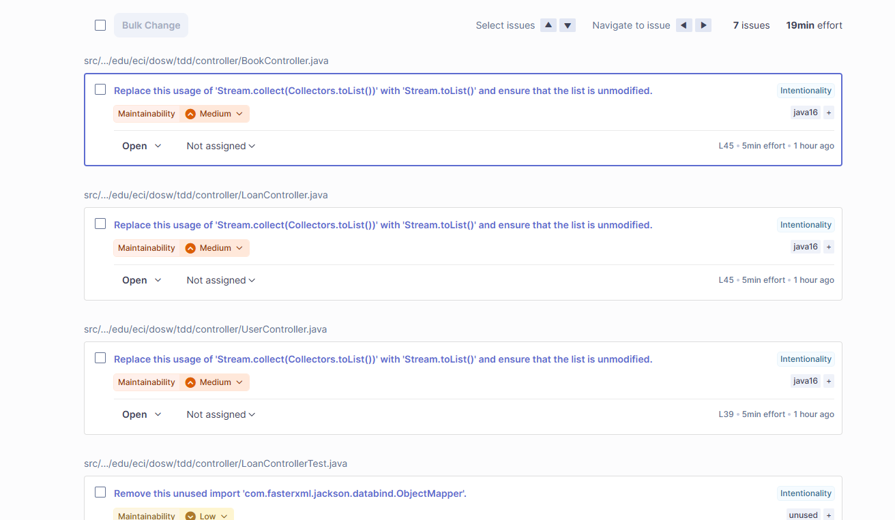

# Análisis de Cobertura y Calidad de Pruebas 🧪

Este documento contiene los reportes y el análisis de cobertura de código generados por las diferentes herramientas de calidad del proyecto.

## 📊 Métricas de Cobertura

### 🖥️ IntelliJ IDEA Coverage
_Análisis de cobertura nativo del IDE para ejecuciones rápidas durante el desarrollo._

> 

> 

---

### 🛡️ JaCoCo 
_Reporte detallado generado mediante Maven para la integración continua y validación de calidad._

> 

---

### 🔍 SonarQube
_Análisis estático de código, detección de bugs, vulnerabilidades y deuda técnica._

> 
 
> 

> 

### Análisis de Calidad - SonarQube
El análisis estático realizado con SonarQube arroja resultados sobresalientes para el sistema DOSW-Library, destacando la solidez de la lógica implementada y la efectividad de la suite de pruebas.

1. Métricas Principales
   Coverage (91.9%): Este es el punto más fuerte. Se logró cubrir la gran mayoría de las líneas de código , superando con creces el mínimo estándar. Esto garantiza que casi toda la lógica de préstamos y validaciones ha sido verificada.

Duplications (0.0%): El código es limpio y no presenta redundancias. Cada componente tiene una responsabilidad única.

Reliability & Security (Rating A): Se cuenta con 0 vulnerabilidades y 0 bugs abiertos, lo que indica que el sistema es seguro y confiable.

2. Mantenibilidad y Deuda Técnica
   SonarQube identificó 7 "Open Issues" relacionados con la mantenibilidad, con un esfuerzo estimado de solución de solo 19 minutos:

Sugerencia de Refactorización en Streams: En los controladores (BookController, LoanController, UserController), Sonar sugiere reemplazar .collect(Collectors.toList()) por el método más moderno .toList() (disponible desde Java 16). Esto hace el código más legible y genera listas inmutables por defecto.

Limpieza de Código: Se detectó un import no utilizado en LoanControllerTest (ObjectMapper). Eliminarlo ayuda a mantener el proyecto limpio y evita dependencias innecesarias en las pruebas.

3. Conclusión de Calidad
   El proyecto ha superado el Quality Gate, demostrando que la refactorización hacia una arquitectura basada en servicios y DTOs, junto con la implementación de pruebas unitarias exhaustivas, resultó en un software mantenible, seguro y con una cobertura excepcional.
